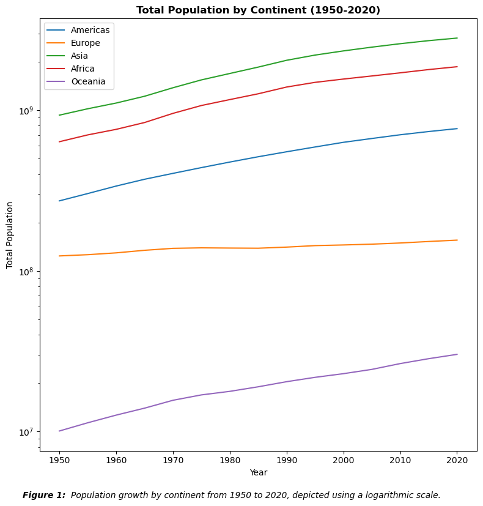
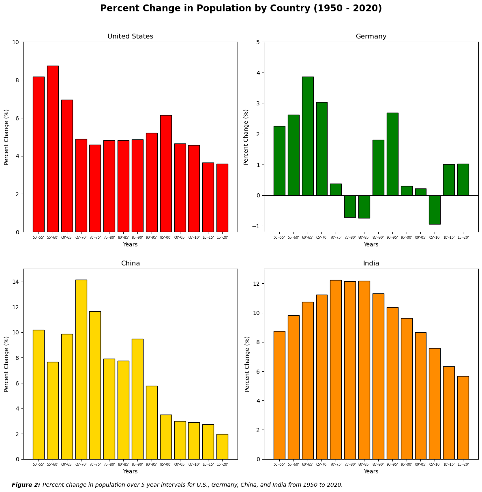
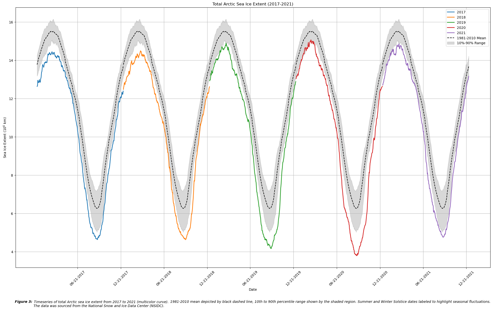

# Assignment 04 – Time Series & Bar Chart Visualization

This assignment focuses on time series and comparative bar chart visualization using Python and matplotlib. The dataset includes:

- Total Arctic sea ice extent from 2017–2021 with comparison to climatological mean (1981–2010)
- Global population changes by continent and country (1950–2020)

---

---

## Included Files
- `assignment4_Keen.ipynb`: Full notebook with data analysis, code, and plots
- `HW4_plot1_Keen.png`: Population by continent (log-scale)
- `HW4_plot2_Keen.png`: Percent change in population by country
- `HW4_plot3_Keen.png`: Arctic sea ice extent time series

## Key Skills Demonstrated
- Time series visualization
- Subplot and multi-panel layout formatting
- Statistical overlays and annotation
- Working with long-term observational datasets
